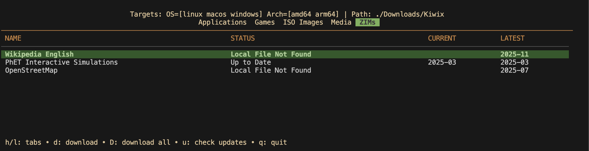

# LAMP: Local Asset Management Program

**LAMP** is an amatuer TUI app designed to automate the downloading & management of software assets such as desktop and android applications, ISO files, and ZIM files across different operating systems and architectures.



- [LAMP: Local Asset Management Program](#lamp-local-asset-management-program)
  - [Key Features](#key-features)
  - [Extensibility \& Customization](#extensibility--customization)
  - [Getting Started](#getting-started)
    - [Prerequisites](#prerequisites)
    - [Installation](#installation)
      - [From Pre-built Binaries](#from-pre-built-binaries)
      - [From Source](#from-source)
    - [Configuration](#configuration)
  - [Usage](#usage)

---

## Key Features

- **Interactive TUI**: A high-performance terminal interface built with the Charmbracelet `bubbletea` framework (Thanks!).
- **Multi-Platform & Multi-Architecture Support**: Manages assets for Windows, macOS, and Linux for both AMD64 and ARM64 architectures.
- **Completely Configurable**: Easily add new catalog sources for applications, ISOs, and ZIMs, or almost any other asset you want to track!
- **Update Checking**: Easy version checking between locally stored versions and the latest upstream releases.
- **Disk Space Checking**: Ensures you have enough space to download a file before downloading it.
- **GitHub API Integration**: Leverages the GitHub API to extend rate limits for relevant catalog sources with a provided API key.

## Extensibility & Customization

LAMP is built with a "Configuration-as-Code" philosophy, making it highly extensible:

- **YAML Catalogs**: Easily expand the ecosystem by adding custom `.yaml` definitions in the `catalogs/` directory.
- **Flexible Strategies**: Supports multiple version-tracking strategies, including GitHub Releases, RSS feeds, and dynamic URL resolution.
- **Source Expansion**: Define a single source and let LAMP automatically expand it into architecture-specific entries (e.g., `{{os}}`, `{{arch}}`, `{{ext}}`).
- **Path Overrides**: Fully configurable storage structure to organize your assets how you want them.
- **Template Mapping**: Flexible template mapping for customizing asset names and paths, with automatic OS subdirectory placement if relevant.

For example: `"kiwix-desktop_{{os_map}}{{arch_map}}_.*\\.{{ext}}"` can expand to:

- `kiwix-desktop_x86_64_2.4.1.appimage`
- `kiwix-desktop_windows_x64_2.4.1.zip`

Note: `{{os_map}}` and `{{arch_map}}` are automatically mapped to their respective values based on the `os_map` and `arch_map` parameters in the `catalogs/apps.yaml` catalog file under the `kiwix-desktop` source.

## Getting Started

### Prerequisites

- [Go](https://go.dev/) 1.25 or later.

### Installation

You can install LAMP in one of two ways:

#### From Pre-built Binaries

Download the latest pre-built binary from the [releases page](https://github.com/acdop100/lamp/releases).
Releases are available for Windows, macOS, and Linux for AMD64 and ARM64 architectures.

#### From Source

Clone the repository and build the binary:

```bash
git clone https://github.com/acdop100/lamp.git
cd lamp
go build -o lamp
```

### Configuration

On the first run, LAMP will automatically create a configuration directory and populate it with default settings and catalogs if they do not already exist.

**Configuration Locations:**
| Operating System | Path                                  |
| :--------------- | :------------------------------------ |
| **Windows**      | `%AppData%\lamp\`                     |
| **macOS**        | `~/Library/Application Support/lamp/` |
| **Linux**        | `~/.config/lamp/`                     |

Within this directory, you will find:
- `config.yaml`: Main application settings (download thread # & location, OS/Arch targets, and enabled sources).
- `catalogs/`: Directory containing source definitions for various apps and assets.

**Tips:**
- **Easy Access**: Press `c` within the TUI to open your configuration directory in your default file manager.
- **Local Override**: You can place a `config.yaml` in the same directory as the binary to override the global configuration if desired.
- **GitHub Token**: If you are hitting rate limits from GitHub, add a `GITHUB_TOKEN` to your environment or a `.env` file in the configuration directory.

## Usage

Launch the TUI:
```bash
./lamp
```

Run a quick status check via the `-check` flag:
```bash
$ ./lamp -check
Checking status of all monitored applications...
--------------------------------------------------
[Applications] BalenaEtcher [macos/amd64]: Local File Not Found [Latest: v2.1.4]
[Applications] BalenaEtcher [macos/arm64]: Local File Not Found [Latest: v2.1.4]
[Applications] BalenaEtcher [windows/amd64]: Local File Not Found [Latest: v2.1.4]
[Applications] Kiwix Desktop [windows/amd64]: Local File Not Found [Latest: 2.4.1]
[Applications] Kiwix Desktop [macos/universal]: Up to Date [3.11.0 -> 3.11.0]
...
```
