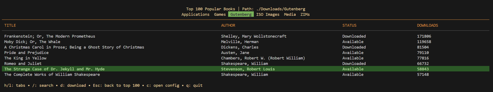
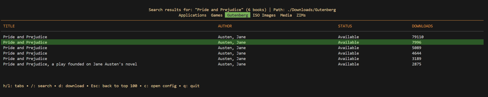

# LAMP User Guide

This guide covers the usage, configuration, and extensibility of LAMP.

## Table of Contents

- [LAMP User Guide](#lamp-user-guide)
  - [Table of Contents](#table-of-contents)
  - [TUI Controls](#tui-controls)
  - [Configuration](#configuration)
  - [Catalogs System](#catalogs-system)
    - [Structure](#structure)
      - [Params](#params)
      - [Maps](#maps)
      - [Exclude](#exclude)
    - [Strategies](#strategies)
    - [Variable Expansion](#variable-expansion)
  - [Project Gutenberg \& Kiwix Library](#project-gutenberg--kiwix-library)

## TUI Controls

LAMP is designed to be fully navigable via keyboard.

| Key                    | Action                                                                |
| :--------------------- | :-------------------------------------------------------------------- |
| `h` / `l` or `←` / `→` | Switch tabs                                                           |
| `j` / `k` or `↓` / `↑` | Navigate lists                                                        |
| `u`                    | **Check for Updates** (Current category only)                         |
| `U`                    | **Update All** (Downloads only files with "Newer Version Available")  |
| `d`                    | **Download** (Download the currently selected item)                   |
| `D`                    | **Download Missing** (Queues all files marked "Local File Not Found") |
| `/` or `s`             | **Search** (Project Gutenberg tab only)                               |
| `c`                    | Open default configuration directory                                  |
| `Esc`                  | **Go Back** to main UI from search                                    |
| `q`                    | **Quit**                                                              |

## Configuration

The `config.yaml` file controls the global behavior of LAMP.

```yaml
general:
  # Target Operating Systems to download for
  os: [windows, linux, macos] 
  # Target Architectures
  arch: [amd64, arm64]
  # Number of concurrent download threads
  threads: 4
  # GitHub Token (Optional, avoids rate limits)
  github_token: "" 

storage:
  # Default root folder for all downloads if other paths are not specified (see below)
  default_root: "~/Downloads/Lamp" 

categories:
  # Map categories to specific folders
  Applications:
    path: "~/Downloads/Apps"
  Games:
    path: "~/Games/ROMs"
```

## Catalogs System

LAMP uses `yaml` files in the `catalogs/` directory to define what to download. Specifically, catalogs tell LAMP where to find files, how to download them, and how to organize them. This abstracts the download configuration from the user and allows for easy extension by power users. If a new catalog entry uses an existing download strategy (see [Strategies](#strategies) below), then it only needs to define the parameters for that catalog entry and LAMP will handle the rest. If a strategy is required, code changes may be needed and an issue/pull request should be opened.

### Structure

Let's take a look at [Jellyfin Media Player](https://github.com/jellyfin/jellyfin-desktop/releases/tag/v1.12.0) in the `catalogs/apps.yaml` file as an example for how a catalog entry is structured:

```yaml
- id: "jellyfin-player"
    # Name: How the entry is listed in the TUI
    name: "Jellyfin Media Player"
    # Strategy: The download strategy to use (see [Strategies](#strategies) below)
    strategy: "github_release"
    # Params: The parameters for the download strategy
    params:
      repo: "jellyfin/jellyfin-media-player"
      # JellyfinMediaPlayer-1.12.0-AppleSilicon.dmg
      # JellyfinMediaPlayer-1.12.0-Intel.dmg
      # JellyfinMediaPlayer-1.12.0-windows-x64.exe
      asset_pattern: "JellyfinMediaPlayer-.*-{{arch_map}}\\.{{ext}}"
      force_os_display: "true"
    # Arch Map: Maps OS/Arch combinations to specific values
    arch_map:
      macos/amd64: "Intel"
      macos/arm64: "AppleSilicon"
      windows/amd64: "windows-x64"
    # Ext Map: Maps OS to specific extensions
    ext_map:
      windows: "exe"
      macos: "dmg"
    # Exclude: List of OS/Arch combinations to exclude
    exclude: ["linux", "windows/arm64"]
```

Let's break the params and *_maps down a bit more:

#### Params

Params are the parameters for the download strategy. In this case, we're using `github_release` strategy, so we need to provide the repository and asset pattern. The repo will automatically assume github.com as the base URL since we use the github go library. Releases from similar platforms like GitLab or Bitbucket are not currently supported in the same manner, but may be able to be bruteforced with a different strategy.

Asset patterns are used to match the assets in the release. You can see how this works on the Jellyfin Media Player page. To support as many operating systems and computer architectures as possible, we use variable expansion to map the OS/Arch combinations to specific values. 

The `force_os_display` parameter is used to force the OS to be displayed in the TUI table entry.
The `arch_override` parameter can be used to manually specify the architecture part of the name (e.g., if you want to group multiple architectures under a single name or correct a display issue such as "universal" macOS binaries).

```yaml
params:
  repo: "jellyfin/jellyfin-media-player"
  asset_pattern: "JellyfinMediaPlayer-.*-{{arch_map}}\\.{{ext}}"
  force_os_display: "true"
```

#### Maps

Maps are used to map OS/Arch combinations from the param's asset pattern expansion to specific values. This is needed because, unfortunately, different developers use different naming conventions for their assets. In this case, we're mapping `macos/amd64` to `Intel` and `macos/arm64` to `AppleSilicon`.

```yaml
arch_map:
  macos/amd64: "Intel"
  macos/arm64: "AppleSilicon"
```

Extension maps work the same way as arch maps, but they map OS to specific extensions. For example, we can map `windows` to `exe` and `macos` to `dmg` since that is how they are named in the Jellyfin Media Player releases.

```yaml
ext_map:
  windows: "exe"
  macos: "dmg"
```

Some projects may only release builds as zip files, tarballs, or some other format. Make sure to map the OS to the correct extension. **It would suck to download all of these files only to find out that they are not compatible with your system!**

#### Exclude

Exclude is used to exclude OS/Arch combinations from the download. This is useful for excluding unsupported operating systems or architectures so users don't see them in the TUI. You can either exclude an entire OS, entire architecture, or a specific OS/Arch combination. For the Jellyfin Media Player example, we exclude `linux` and `windows/arm64` since those builds are not provided by the developer. Technically, Jellyfin Media Player is available for Linux, but it is not available in the `AppImage` format which is what we use since it is the most cross-platform. 

```yaml
exclude: ["linux", "windows/arm64"]
```

### Strategies

Strategies are used to download files from the internet from different sources. The following strategies are currently implemented by default:

| Strategy         | Description                               | Required Params                                |
| :--------------- | :---------------------------------------- | :--------------------------------------------- |
| `github_release` | Fetches latest release from GitHub API.   | `repo`, `asset_pattern`                        |
| `web_scrape`     | Scrapes a directory listing for versions. | `base_url`, `version_pattern`, `file_template` |
| `rss_feed`       | Parses an RSS feed (e.g., Kiwix).         | `feed_url`, `item_pattern`                     |
| `http_redirect`  | Follows a "latest" URL to final file.     | `url`, `version_pattern` (optional)            |
| `chromium_gcs`   | Scans Google Cloud Storage buckets.       | `prefix`, `filename`                           |
| `gutenberg`      | Fetches books from Project Gutenberg.     | `language`, `organization`                     |

Some of these are specific to a certain project, but the hope is that they can be extended to support more projects in the future.

### Variable Expansion

You can use the following variables in `params` to dynamically generate URLs for different OS/Arch combinations. The non-map `os-*` and `arch` variables can be used if override mappings aren't necessary:

- `{{os}}`: `windows`, `macos`, `linux`
- `{{os_short}}`: `win`, `mac`, `linux`
- `{{os_proper}}`: `Windows`, `macOS`, `Linux`
- `{{arch}}`: `amd64`, `arm64`
- `{{os_map}}`: Value mapped from `os_map` section.
- `{{arch_map}}`: Value mapped from `arch_map` section.
- `{{ext}}`: Value mapped from `ext_map` section.

## Project Gutenberg & Kiwix Library

The `Gutenberg` and `Kiwix Library` tabs allow you to browse and download public domain ebooks and ZIM files if enabled in your config.yaml. By default, it loads the Top 100 most popular books and first 100 ZIM files from the main catalog. Users can search for books using the `/` or `s` key and press enter to download the `EPUB3` file or `ZIM` file formats respectively. Files are saved to the configured path, with books organized by Author or ID based on your catalog settings and ZIM files organized by Category if available.

Project Gutenberg default UI:


Project Gutenberg Search UI:


The search could be improved but am pushing that to a future version.